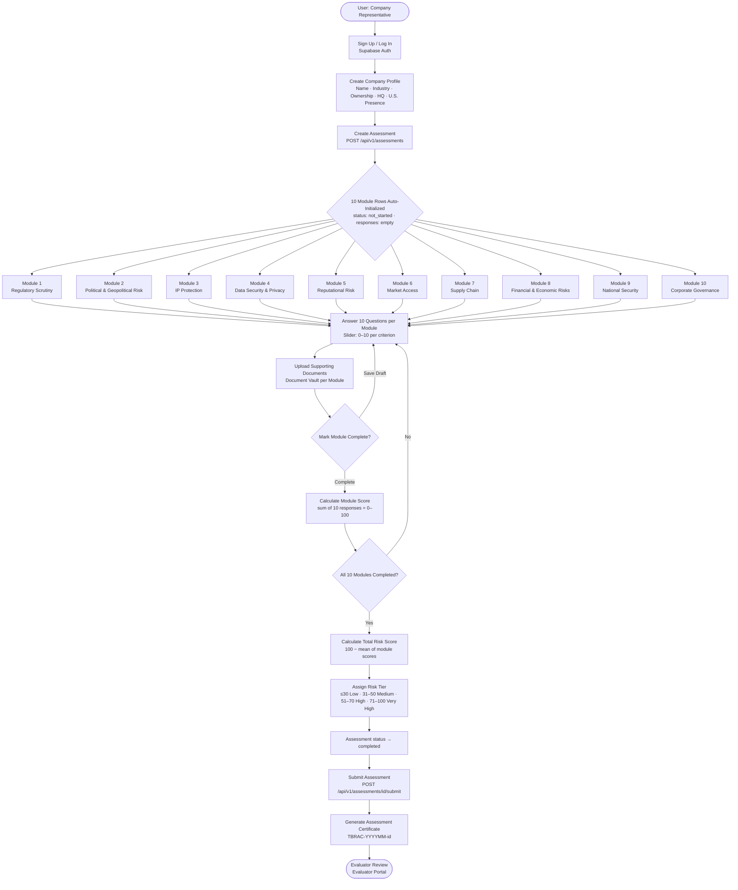
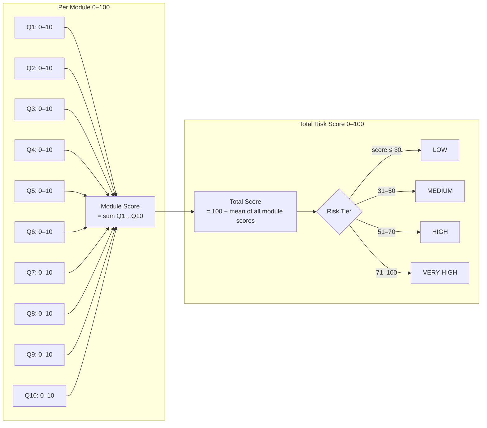
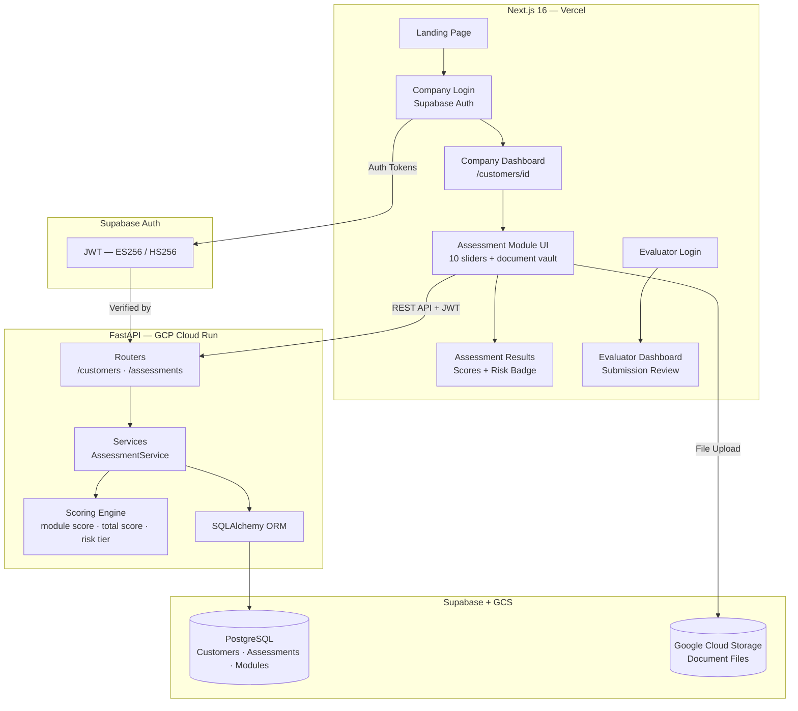

# TBRAC System Logic Structure

## End-to-End Data Flow

---

## Scoring Sub-Flow

---

## System Architecture Components

---

## Key Invariants

| Rule | Detail |
|---|---|
| One customer per user | Each sign-up creates exactly one customer record |
| 10 modules per assessment | All initialized at creation; cannot add or remove |
| Questions scored 0–10 | 0 = worst risk, 10 = best compliance |
| Module score range | 0–100 (sum of 10 questions) |
| Total score direction | Higher = more risk (inverted from module compliance score) |
| Assessment locked on submit | No edits after `status: submitted` |
| Migrations on startup | `alembic upgrade head` runs before gunicorn in production |
